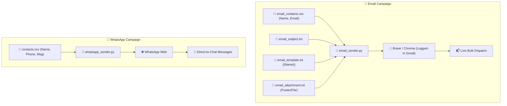

<div align="center">

# ⚡ Bulk Outreach Automation Suite
### *High-Performance, Zero-Password Bulk Messaging for WhatsApp Web & Gmail Web*

[](https://www.python.org/)
[](https://www.selenium.dev/)
[](https://brave.com/)
[](https://www.google.com/chrome/)
[](LICENSE)

<p align="center">
  <b>Dual-Channel Dispatch</b> • <b>Brave/Chrome Logged-In Profile</b> • <b>One-Time Template Design</b> • <b>Zero Password Required</b>
</p>

---

</div>

## 📌 Overview

This repository provides two automated dispatch engines built on top of Selenium:

1. **📧 Gmail Web Bulk Automator (`email_sender.py`)**:
   - Uses your **existing logged-in browser profile** (Brave / Chrome) — no Google App Passwords or 2FA hassle.
   - Supports **multi-account switching**: switch to any Gmail account tab in Brave before typing `send`.
   - **Modular template setup**: keep recipient emails, campaign subject, email body, and poster attachments in separate, easy-to-edit files.
   - Auto un-minimizes compose dialogs and verifies attachment uploads before sending.

2. **💬 WhatsApp Web Bulk Automator (`whatsapp_sender.py`)**:
   - Automated direct-chat routing via URL encoding.
   - Dynamic per-contact personalization and safe rate-pacing delays.



---

## 📧 Gmail Web Bulk Automator

### 📂 File Structure

| File | Purpose | Example / Details |
| :--- | :--- | :--- |
| **[email_contacts.csv](file:///c:/python%20script/email_contacts.csv)** | Contact list | Just two columns: `Name,Email`. Add as many rows as you need. |
| **[email_subject.txt](file:///c:/python%20script/email_subject.txt)** | Campaign Subject | E.g., `Invitation for VIBRANT 2K26 Fest` |
| **[email_template.txt](file:///c:/python%20script/email_template.txt)** | Campaign Body Template | Full text message with `{Name}` dynamic placeholder. |
| **[email_attachment.txt](file:///c:/python%20script/email_attachment.txt)** | Attachment Path | Absolute file path, e.g. `C:\Users\amitm\OneDrive\Desktop\poster.jpeg` |

### 🚀 Running the Email Automator

```powershell
python email_sender.py
```

1. **Brave launches** automatically with your existing logged-in Gmail profile on dedicated debugging port `9555`.
2. **Switch Accounts Freely**: If you have multiple Gmail accounts, click your profile avatar in Gmail and select the account you want to send from.
3. **Trigger Dispatch**: Return to your terminal and type **`send`** (or press `[Enter]`).
4. The automator detects your active account, un-minimizes compose boxes, fills the recipient, subject, and personalized body, uploads the poster attachment, and dispatches the emails!

```
[1/3] 🌐 Launching Brave with your logged-in Gmail profile...
[2/3] 📬 Brave is open with Gmail Web!
👉 Type 'send' (or press Enter) when ready to start sending: send

✅ Active Sender Account Detected: <amitmyadv@gmail.com> (Account /u/1)
🚀 Dispatching all emails from this account!

[3/3] Iterating 13 email contact(s)...
  ↳ [1/13] Sending email to Amit (amitfblock@gmail.com)...  [Attaching poster.jpeg...] [OK]
  ↳ [2/13] Sending email to amitvista (24112cn076@glbitm.ac.in)...  [Attaching poster.jpeg...] [OK]
...
🎉 All emails processed!
   Successfully Sent: 13
   Failed/Skipped:    0
```

---

## 💬 WhatsApp Web Bulk Automator

### ⚙️ Contacts Configuration

Configure your contacts in [contacts.csv](file:///c:/python%20script/contacts.csv). Format phone numbers with international **country code** (without `+` or leading `00`):

```csv
Name,Phone,Message
John Doe,919876543210,"Hello John, this is an example test message."
Jane Smith,919876543211,"Hi Jane, your registration is confirmed."
# Inactive User,919876543299,"Commented out row will be skipped."
```

### 🚀 Running the WhatsApp Automator

```powershell
python whatsapp_sender.py
```

1. Chrome/Brave opens WhatsApp Web.
2. Scan the QR code once with your phone.
3. Once logged in, the script dispatches personalized messages to every recipient with safe pacing intervals.

---

## 🛠️ Repository Directory Tree

```tree
📦 python script/
 ┣ 📜 README.md              # Complete guide & documentation
 ┣ 📜 requirements.txt       # Dependencies (selenium, pandas, webdriver-manager)
 ┣ 📊 email_contacts.csv     # Email recipient list (Name, Email)
 ┣ 📝 email_subject.txt      # Campaign email subject line
 ┣ 📝 email_template.txt     # Campaign email body template with {Name}
 ┣ 📎 email_attachment.txt   # File path to default poster / attachment
 ┣ 🚀 email_sender.py        # Zero-password Gmail Web bulk automator
 ┣ 📊 contacts.csv           # WhatsApp contacts & messages
 ┗ 🚀 whatsapp_sender.py     # WhatsApp Web bulk automation engine
```

---

## ⚠️ Safe Outreach Guidelines

> [!IMPORTANT]
> - ✅ **Test first**: Send to your personal email/phone number before running large campaigns.
> - ✅ **Pacing**: Both scripts enforce built-in delay intervals (3–5 seconds) between dispatches to maintain healthy sender reputation.
> - ✅ **Consent**: Ensure all recipients have opted in or have a legitimate relationship to your organization.

---

<div align="center">
  <sub>Built with ❤️ for clean, modular, and effortless bulk outreach.</sub>
</div>